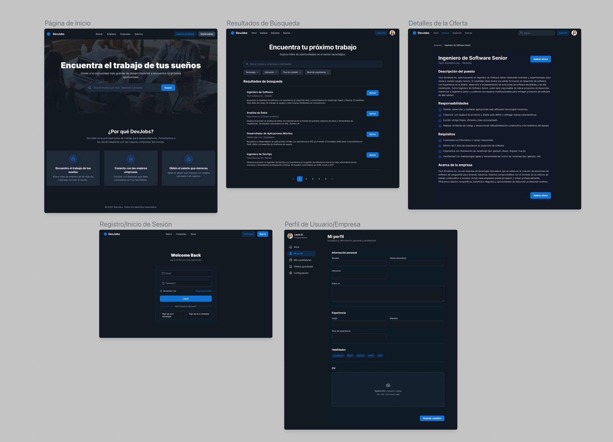

# 🚀 JSCamp Full-Stack Bootcamp

---

---

This repository contains notes, exercises, and materials related to the **Intensive Full-Stack Web Development Bootcamp** from the academy of **Miguel Ángel Durán (midudev)**.

The purpose of this repo is to document and practice everything learned during the bootcamp.

---

## 🎯 Learning Objectives

By the end of the bootcamp, the goal is to have practiced:

- Building complete web applications from scratch
- Mastering the modern JavaScript ecosystem
- Creating REST APIs with Node.js
- Developing interfaces with React
- Implementing SQL databases
- Setting up CI/CD pipelines
- Containerizing applications with Docker
- Using TypeScript in real projects

---

## 📚 Bootcamp Content

- **00** - HTML & CSS
- **01** - JavaScript
- **02** - React
- **03** - Estado Global y React Router
- **04** - Node.js
- **05** - TypeScript
- **06** - Integración de IA
- **07** - SQL
- **08** - CI/CD
- **09** - Docker

---

## 🎨 Practical Project

During the bootcamp, a **full-stack project will be built from scratch**, applying the knowledge from each module.  
This project will serve as part of the **personal portfolio**.

👉 [View Project Design](https://jscamp.dev)

---

## 💻 Installation Requirements

- Modern browser (Chrome, Firefox, Edge, or Safari)
- [Visual Studio Code](https://code.visualstudio.com/) + extension _Live Preview_
- [Node.js](https://nodejs.org/) (v20 or higher)
- [Git](https://git-scm.com/)
- [Docker](https://www.docker.com/)
- [Warp](https://www.warp.dev/) (optional, terminal with AI and agents)

---

## 📺 Platform

The bootcamp content is available at **[JSCamp.dev](https://jscamp.dev)**.

---

## 👨‍💻 Instructor

The bootcamp is taught by **Miguel Ángel Durán (midudev)**

- 💼 LinkedIn: [midudev](https://www.linkedin.com/in/midudev)
- 🌍 Web: [midu.dev](https://midu.dev)

---

## 👨‍💻 Practical Project

